# 靓靓——美妆产品成分查询与评分小程序的设计与实现

> 公开脱敏版：保留论文正文与技术插图；学校模板、页眉页脚、校徽、身份元数据不进入公开文件，含个人资料或凭据的截图已隐藏。

## 第1章 绪论

### 1.1研究背景

随着社会的发展,人们的生活水平不断提高，对于化妆品中的个人护肤类产品以及美妆类产品的需求不断增加。现在美妆类产品以及个人护理类产品多种多样，人们如何购买适合自己的化妆产品是一个很值得研究的事情，一个美妆产品成分查询与评分小程序，可以让他们直观的看见各个品牌、各个类型的美妆护肤类产品的成分以及其他买家对于使用某款自己感兴趣的美妆护肤类产品的感受与评分，帮助他们选择更加适合自己的美妆护肤类产品，也可以跟其他用户一起交流讨论，相互帮助，共同探讨。

使用美妆产品成分查询与评分小程序具备很多优点：首先可以大幅提高商品信息检索，只需输入美妆护肤类产品相关信息就能在数秒内反馈想要的结果；其次可存储大量的产品信息，同时美妆产品成分查询与评分小程序安全性有更高的保障，更节省空间人力资源。这些优点大大提高管理者的工作效率并节省商家成本，再通过微信小程序这一平台，个人和组织都可以打造一个类似于软件的开发平台，一种不需要下载安装即可使用的应用小程序[1]。

### 1.2国外研究现状

国外美妆护肤类产品APP的研究源于新媒体时代的兴起，化妆品企业的营销模式从以前传统媒体逐渐发展为线上线下全渠道的营销网络矩阵[2]。美妆APP发展问题开始备受国际经济学界的高度关注和重视，成为诸多学者关注的热点，取得了较多研究成果。例如澳洲最大日韩美妆APP-BabyFace主要是各类型美妆护肤产品的推荐与销售。韩国的화해APP可以查看美妆护肤产品的排名以及成分，按不同的功能也有分类排名。美国的丝芙兰APP主要是各类美妆品牌产品的销售功能、AR试妆功能以及美妆社区的功能，可以看见类别产品销售量的排行榜，用户购买使用后可以进行评论交流。与传统美妆杂志相比，美妆类APP的出现依托于移动互联网，因此更具即时性、便捷性和精确性。美妆用户还可以在APP中“输入”个体信息后，获取到更有针对性的个性化美妆服务或内容推荐[3]。

### 1.3国内研究现状

国内关于美妆护肤类产品小程序的研究源于越来越多的化妆品企业开始选择在抖音等新兴媒体上凭借短视频等各类方式进行产品内容营销推广[4]。自此开

始成为诸多学者关注的热点，取得了较多研究成果，例如内容社区类美妆APP使用推荐算法技术，基本能做到精准推荐用户感兴趣的内容，主打美妆产品的种草、测评、心得、推荐与分享等与内容相关的功能与信息；检测工具类APP使用图像识别技术主打智能测肤、基因检测、护肤方案定制等功能，同时部分产品兼具内容社区与社交电商的相关功能；垂直电商类美妆APP，主打美妆产品的一站式销售[5]，其产品运营和日常推广过于陈旧有所局限，且其内容极易受各大品牌影响，对于消费者来说信息不全面，因此此类APP上产品信息的价值并不高。而靓靓小程序可以做到用户可以随时随地通过小程序查询美妆产品的成分，以及提供产品成分的详细信息，使用户更了解产品。还能避免过敏，降低使用风险，为消费者购买提供参考，也比较不同产品，方便用户对多个产品的成分进行比较。还可以节约消费者时间，快速获取所需信息，促进理性消费，帮助用户做出更明智的购买决策。

互联网时代新媒体营销具有针对性、符合现代社会大众行为习惯和渠道丰富的特点[6]。在利用新媒体平台进行推广和直播经济的带动下，线上美妆护肤类产品APP日益壮大[7]。美妆APP为美妆产品提供了新的传播渠道，用户通过美妆APP可以随时随地了解与美妆相关的各类信息，并完成社交分享、商品交易等转化行为[8]。

### 1.4研究意义

通过国内外美妆护肤类产品APP的研究，发现国内外的美妆护肤类产品APP发展种类繁多但都有一定不足。本文设计的美妆产品成分查询与评分小程序则专为消费者提供美妆护肤类产品推荐，以及产品评分功能，使用户能清晰了解到各个产品更多信息，包括成分构成、功效特点等，有助于用户在鱼龙混杂的互联网营销环境下更精准的选择更加适合自己的美妆护肤类产品。且微信小程序作为依附于微信框架上的应用，在微信上有着广阔的应用前景及优质用户，流量巨大，方便快捷，微信拥有庞大的用户基础和高流量，这为小程序的推广和使用提供了有力支持。

综上所述，这款美妆产品成分查询与评分小程序凭借其独特的功能和微信小程序的优势，有望成为消费者在选购美妆护肤产品时的得力助手。

### 1.5论文结构与内容

本文共分为八章，每章的主要内容如下：

## 第一章绪论，介绍了论文的研究背景、研究现状和研究意义，并提出了现阶段遇到的一些问题，最后介绍了本文的主要内容及组织结构。

## 第二章简略的介绍了开发本系统采用的相关技术。

## 第三章介绍本系统的可行性分析以及需求分析，分别从功能需求和非功能性需求两个方向进行讲解。

## 第四章介绍本系统的总体设计，系统开发流程设计以及详细的叙述部分数据库的设计，从数据库的概念设计到具体的数据库构建。

## 第五章介绍本系统的详细设计。分别对各个功能模块进行详细讲解。

## 第六章是实现本系统，并展示了实现了的主要界面以及功能和关键代码。

## 第七章是测试已实现的系统。首先给出测试概念，然后根据测试目标分别对系统的不同阶段进行功能测试与系统的性能测试，最后给出测试结果。

## 第八章是总结与展望。先总结了本文做出的主要工作，再对本系统的开发做进一步地展望。

## 第2章 系统开发相关技术

本小程序主要是使用springBoot实现服务端、vue技术实现前端页面、mybatis-plus数据中间层、mysql、redis开发者工具以及微信开发者工具实现小程序前端来实现。

### 2.1 springBoot技术

Spring Boot是一个基于Spring框架的快速开发脚手架，它简化了Spring应用的初始化和搭建过程，提供了众多便利的功能和特性，比如自动配置、嵌入式Tomcat等，让开发人员可以更加专注于业务逻辑的实现。对于 springboot框架来说，它集成了spring的优势，减少了不必要的配置，在该框架中不需要进行像spring 样的bean配置，只需要通过注解，就能实现bean的配置及自动管理，还可以通过注解减少xml文件的设置[9]。pring Boot的目标不在于为已解决的问题域提供新的解决方案,而是为平台带来另一种开发体验,从而简化对这些已有技术的使用[10]。它使应用程序开发速度更快，更容易部署和管理，并且可以与现有的Spring生态基础设施集成，使得开发人员能够快速地构建和部署应用程序。

### 2.2 Vue技术

Vue 是一套用于构建用户界面的渐进式框架(部分使用)，作为一款渐进式框架，Vue.js使用组件化的方式构建应用，使得代码更具可维护性和可重用性[11]。它基于标准HTML、CSS和JavaScript构建，并提供了一套声明式的、组件化的编程模型，可以更加高效的开发用户界面。vue是一款简单的mvvm（model-view-viewmodel）框架，MVVM分为三层，View表示视图层，负责在网页中所呈现的画面，Model表示 数据模型层，所有与数据相关的操作都在这一层，ViewModel表示的是中间层，这是 MVVM模式中最为核心的一层，负责View层与Model层之间的数据交互[12]。

### 2.3 mybatis-plus技术

mybatis-plus是一个mybatis增强版工具，在mybatis上扩充了其他功能没有改变其基本功能，为了简化开发提交效率而存在。具有以下几种优点：①该插件对整个框架无侵入。②该插件造成的损耗极小。③该插件的CRUD 的功能的操作十分强大。④Mybatis-Plus与多种数据库 兼容、可以使用Lambda 形式来调用并且功能十分强大。MyBatis 是一款开源的持久层框架，支持定制化查询，存储过程和高级映射[13]。MyBatis-Plus（简称 MP）是MyBatis的增强 版，它内置有各种生成器和插件并支持多种数据库操作[14]。

### 2.4 Mysql

MySQL是一种开源的关系型数据库管理系统，MySQL数据库系统因其开放源码、 运行速度快、 磁盘空间占用少等优点，得到了广泛的应用[15]。MySQL采用了客户端/服务器模式，允许多个客户端连接到数据库服务器并进行数据交互。MySQL是一个非常流行的关系型数据库管理系统，被广泛应用于Web应用、电子商务、金融、电信、科研等领域。MySQL拥有快速的读写速度和高效的查询性能，可以处理大规模的数据，并能提供多种安全特性，包括用户权限控制、数据加密、网络传输加密[16]。

### 2.5 Redis技术

Redis是一种开源的内存数据存储系统，它支持多种数据结构，包括字符串、哈希、列表、集合和有序集合等。Redis 是缓存型数据库，它的大小取决于内存的大小[17]。Redis的数据存储在内存中，因此具有极快的读写速度，同时也支持数据持久化，可以将内存中的数据保存到磁盘中，以保证数据的安全性。Ｒedis 是一种开源的、支持网络、可基于内存亦 可持久化的日志型、Key－Value 数据库，并提供多 种语言的API[18]。Redis不仅仅是一个内存缓存系统，还可以作为消息队列、分布式锁等多种用途。它提供了一系列的原子操作，使得开发人员可以轻松地对数据进行读写和操作。

### 2.6 微信开发者工具

微信开发者工具是专门用于开发微信小程序的集成开发环境（IDE）。 它提供了一系列工具和功能，方便开发者开发、调试、预览、上传和发布小程序。 微信开发者工具基于该框架，采用Node.js和技术开发，支持两种操作系统。 在微信开发者工具中，开发者可以使用类似于Web开发的前端技术来开发小程序，例如HTML、CSS等。 同时，微信开发者工具还提供了丰富的API和组件库，方便开发者快速构建小程序的功能和接口。 微信开发者工具的主要技术包括： 前端开发技术：HTML、CSS、JavaScript、JSON；用于构建小程序的页面结构。提供了多种微信特有的组件和标签，用于构建界面。微信小程序框架：基于开源MVVM框架Vue.js开发的小程序框架开发公众号的小程序，提供数据绑定、组件化、模块化等特性 ；后端技术：Java、数据库、API以及Node.js技术：微信开发者工具采用Node.js技术，可以通过Node.js的模块化机制引入和管理第三方库和组件；

### 2.6本章小结

本章主要介绍了开发靓靓小程序使用的具体开发技术，掌握好技术，并且用高效便捷的技术，能使系统开发事半功倍。

系统分析

### 3.1可行性分析

（1）操作可行性：靓靓小程序是通过微信小程序进入，用户操作起来非常方便快捷。智能化是社会发展而带来的必然趋势，各种智能的软件层出不穷，不同的软件能完成用户不同的需求，提高了工作效率。本系统不仅界面简洁明了还采用可视化界面，管理员只要用鼠标和键盘就可以完成对相关信息的修改，删除，添加等操作。因为这个小程序的操作十分简单，方便上手，不需要下载，只需要很少的时间就可以上手操作。由此可见，本小程序在操作上是可行的。

（2）经济可行性：首先就开发技术来说，开发小程序所借助的开发环境都是全部免费的，所以在开发的过程中并不需要额外的成本去使用其他的一些开发技术。其次，此微信小程序需要的手机都是很普遍的，用网络可以使用当地的无线网络或者手机的数据流量，所以成本较低，是可以接受的。美妆产品成分查询与评分小程序的开发不仅可以节约商家所需要的花费，节约资源，还可以更好的管理人员。靓靓小程序既可以为用户节约大量时间成本，同时在这样一个透明的市场，美妆研发公司将会专注于更好产品成分的研究，会节约大量营销成本，美妆类产品市场会陷入良性循环。

（3）技术可行性：当前，Spring Boot、Vue 技术实现、MyBatis-Plus 数据中间层、MySQL 和 Redis 技术备受欢迎。Redis 作为一个轻量级系统，具备高并发、高可用及高性能的优势。它提供的一系列工具和功能，为开发者在开发、调试、预览、上传和发布等环节提供了极大的便利。

本系统的设计充分考虑了操作可行性，使其易于使用和管理。在经济可行性方面，合理利用资源，降低了成本。而在技术可行性方面，采用了成熟且流行的技术，保证了系统的稳定性和可靠性。通过运用这些技术，系统能够更好地满足用户需求，提供高效、稳定的服务。开发者可以借助这些技术的优势，快速搭建和部署系统，提高开发效率。同时，系统具备良好的可扩展性和可维护性，能够适应不断变化的业务需求。

综上所述，本系统的设计融合了多种先进技术，在操作、经济和技术方面都具有可行性，

### 3.2系统需求分析

随着互联网时代的到来，美妆行业也跟随趋势逐渐将重心从线下转移为线上，美妆类APP产品层出不穷，为消费者提供了大量美妆资讯和服务，不可避免的也会有大量或虚假或夸大的营销混入其中，让用户在不知不觉中步入一个又一个消费陷阱，而靓靓小程序就是一个可以让用户自行搜索感兴趣的美妆类产品，并可以直接查询该产品成分，看到其中的各种成分及其作用来判断该产品是否满足自身需求。用户还可通过给产品评分来分享自己在使用某款产品的感受，也可以与其他同肤质同需求用户一起交流使用感受、心得。

### 3.1.1功能需求

靓靓小程序即美妆产品成分查询与评分小程序，是在微信小程序这一平台，整理各类美妆产品及其成分信息包括但不限于产品成分名称、成分安全分、活性成分、致痘风险、使用作用等等信息，以供用户通过直接搜索产品名称查询，这将直接方便用户在消费前进行一此省心省力的小调查，让用户在极短时间内相对精准的确定好需求以及满足需求的产品。用户还可在本程序通过评分评语形式对于曾经使用过的产品进行评价，这会在很大程度实现了以产品真实体验感受、产品真实作用为上，很大程度减小了许多劣质产品、虚假营销产品的生存空间。

用户模块功能如下：

用户通过微信快速靓靓登录小程序，在搜索框内输入产品名称或者产品类型。

用户可以根据自身需求或者产品类型查询对应功能性产品、对应类型评分较高产品。

用户可以直接在产品界面对产品进行评价。

用户可以收藏心仪产品、编辑个人信息、管理发布的评价、动态。

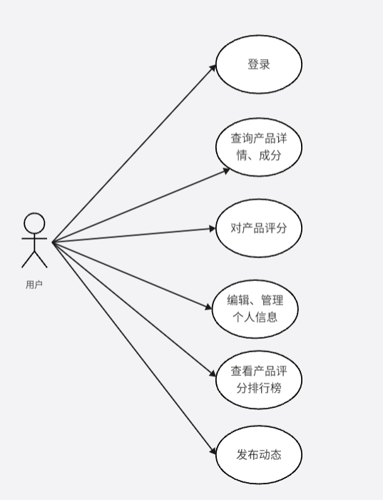

图3-1 用户用例图

管理员模块功能如下：

管理员可以进行注册登录。

管理员可以管理用户信息、产品信息、榜单信息、产品分类信息以及用户评分评论信息。

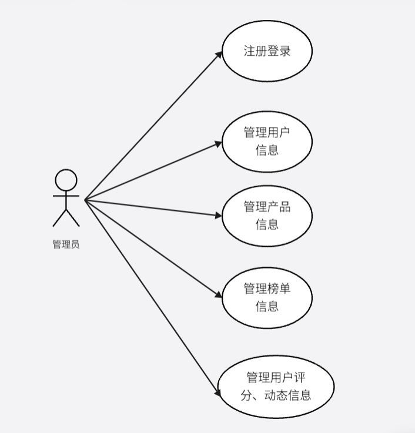

图3-2 管理员用例图

### 3.1.2非功能性需求

易用性：用户界面美观，简洁大方，操作要便捷。

安全性：对于用户信息、产品信息等信息要严格保护。

可靠性：保证小程序的正常运行。

响应时间：对于一款产品成分查询与评分系统，响应时间应在一秒以内。

可维护性与可扩展性：应保证小程序在维护与扩展时，不需要改变系统框架。

### 3.3本章小结

本章主要进行了系统可行性分析、系统功能需求分析和非功能需求分析。

## 第4章 系统总体设计

### 4.1系统开发流程设计

图4-1系统功能结构图

### 4.2系统数据库详细设计

在靓靓小程序中，数据库应当解决以下问题：

保存用户信息，包括账号信息等

保存产品信息，包括相关评论信息等

保存用户动态、评价信息

保存管理员信息

### 4.2.1实体关系模型

用户（用户账号，名称，性别，年龄，头像）

评价（评价账号，日期，评分，文字，图片，用户id）

动态（动态账号，日期，文字，图片，用户账号）

评分（产品账号，评分人数，评分分数）

产品（产品账号，名称，图片，评分，产地，成分，种类）

### 4.2.2概念模型设计

用户

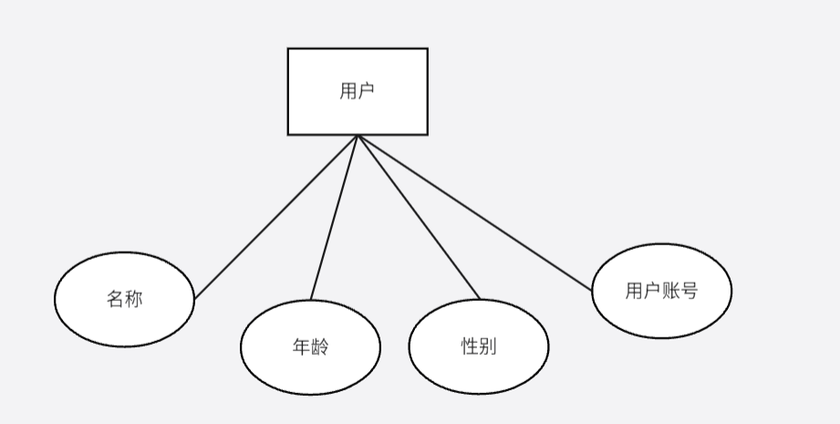

图4-2用户E-R关系图

管理员

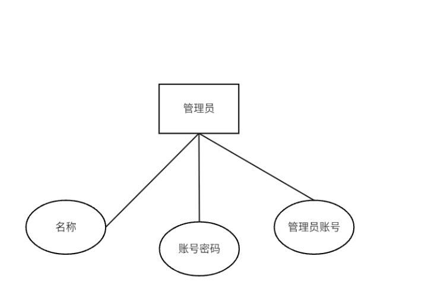

图4-3管理员E-R关系图

产品

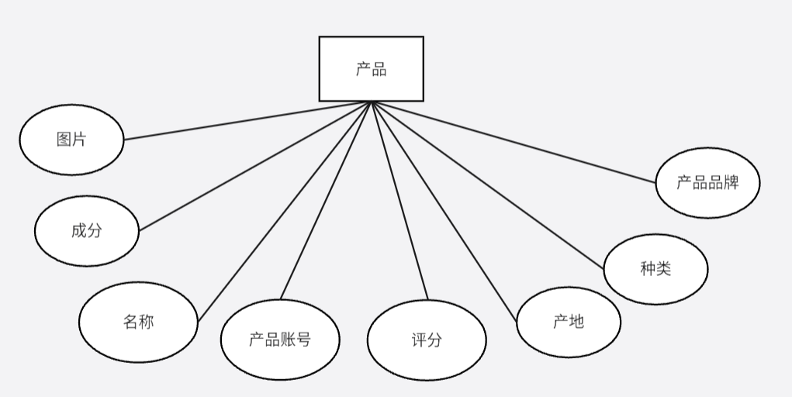

图4-4产品E-R关系图

系统er图

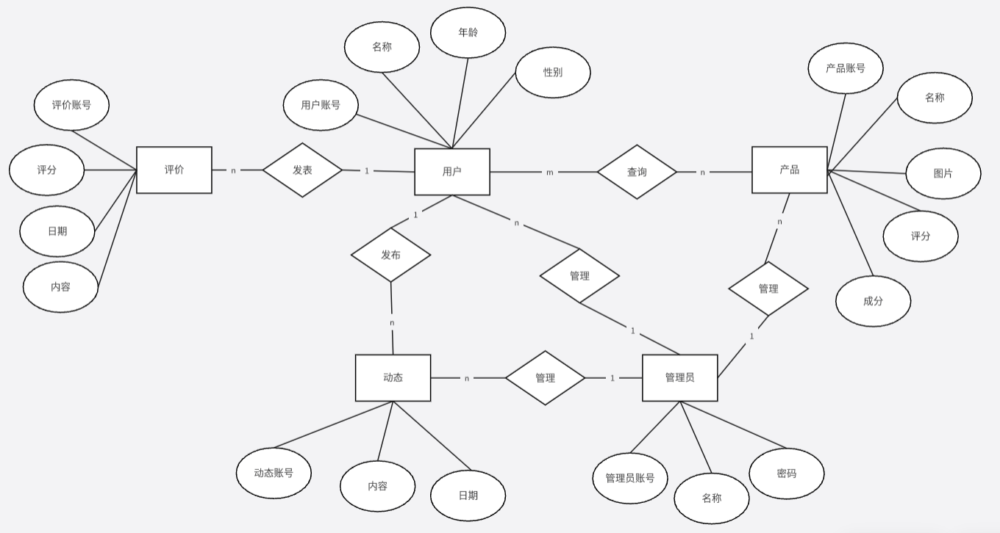

图4-5系统E-R关系图

### 4.2.2逻辑模型设计

一个管理员管理多个用户，一个用户由一个管理员管理，因此管理员和用户是一对多的联系。

一个管理员管理多个产品，一个产品由一个管理员管理，因此管理员和产品是一对多的联系。

一个管理员管理多个动态，一个动态由一个管理员管理，因此管理员和动态是一对多的联系。

一个用户可以发布多个动态，一个动态由一个用户发布，因此用户和动态是一对多的联系。

一个用户可以发布多个评价，一个评价由一个用户发布，因此用户和评价是一对多的联系。

一个用户可以查询多个产品，一个产品可以由多个用户查询/收藏，因此用户和产品是多对多的联系。

### 4.2.3物理模型设计

本程序所用的数据库表有用户表、产品表、成分表、评价表、动态表等。以下是部分表：

用户表（user）

表4.1 用户表

<table>
<tr><td>名称</td><td>字段名</td><td>类型</td><td>长度</td><td>属性</td><td>不是null</td><td>备注</td></tr>
<tr><td>用户账号</td><td>id</td><td>int</td><td></td><td>主键</td><td>是</td><td>用户表主键</td></tr>
<tr><td>姓名</td><td>name</td><td>varchar</td><td>255</td><td></td><td>是</td><td>用户表姓名</td></tr>
<tr><td>电话</td><td>phone</td><td>varchar</td><td>255</td><td></td><td>是</td><td>电话号码</td></tr>
<tr><td>性别</td><td>sex</td><td>int</td><td></td><td></td><td>是</td><td>性别</td></tr>
<tr><td>注册时间</td><td>time</td><td>datetime</td><td></td><td></td><td>是</td><td>账号创建时间</td></tr>
<tr><td>类型</td><td>type</td><td>int</td><td></td><td></td><td>是</td><td>0顾客1管理员,3禁止登录</td></tr>
<tr><td>程序标识</td><td>openld</td><td>varchar</td><td>255</td><td></td><td>否</td><td>微信小程序唯一标识</td></tr>
<tr><td>个人账号</td><td>numder</td><td>varchar</td><td>255</td><td></td><td>否</td><td>登录账号</td></tr>
<tr><td>个人密码</td><td>password</td><td>varchar</td><td>255</td><td></td><td>否</td><td>登录密码</td></tr>
<tr><td>用户头像</td><td>headimg_url</td><td>varchar</td><td>255</td><td></td><td>否</td><td>头像</td></tr>
</table>

产品表（goods）

表4.2 产品表

<table>
<tr><td>名称</td><td>字段名</td><td>类型</td><td>长度</td><td>属性</td><td>不是null</td><td>备注</td></tr>
<tr><td>产品账号</td><td>id</td><td>int</td><td></td><td>主键</td><td>是</td><td>产品主键</td></tr>
<tr><td>名称</td><td>name</td><td>varchar</td><td>255</td><td></td><td>是</td><td>名称</td></tr>
<tr><td>详情</td><td>introduce</td><td>text</td><td></td><td></td><td>是</td><td>介绍,富文本</td></tr>
<tr><td>样图</td><td>images</td><td>varchar</td><td></td><td></td><td>是</td><td>图片</td></tr>
<tr><td>类型</td><td>class_id</td><td>int</td><td></td><td></td><td>否</td><td>所属分类</td></tr>
<tr><td>价格</td><td>peice</td><td>int</td><td></td><td></td><td>否</td><td>价格</td></tr>
<tr><td>产品介绍</td><td>sort_introduce</td><td>text</td><td></td><td></td><td>否</td><td>产品特色,成分等,json字符串</td></tr>
</table>

评价表（evaluation）

表4.3 评价表

<table>
<tr><td>名称</td><td>字段名</td><td>类型</td><td>长度</td><td>属性</td><td>不是null</td><td>备注</td></tr>
<tr><td>评价账号</td><td>id</td><td>int</td><td></td><td>主键</td><td>是</td><td>评价主键</td></tr>
<tr><td>内容</td><td>content</td><td>varchar</td><td>255</td><td></td><td>是</td><td>评价内容</td></tr>
<tr><td>时间</td><td>time</td><td>datetime</td><td></td><td></td><td>是</td><td>时间</td></tr>
<tr><td>用户id</td><td>user_id</td><td>int</td><td></td><td></td><td>是</td><td>评价人</td></tr>
<tr><td>回复id</td><td>reply_id</td><td>int</td><td></td><td></td><td>否</td><td>回复id</td></tr>
<tr><td>产品编号</td><td>goods_id</td><td>int</td><td></td><td></td><td>是</td><td>评价的化妆品</td></tr>
<tr><td>发送回复</td><td>reply_content</td><td>varchar</td><td>255</td><td></td><td>否</td><td>回复内容</td></tr>
<tr><td>回复发送时间</td><td>reply_time</td><td>datetime</td><td></td><td></td><td>否</td><td>回复时间</td></tr>
<tr><td>消息显示</td><td>reply_status</td><td>int</td><td></td><td></td><td>否</td><td>0没有回复1回复</td></tr>
<tr><td>产品打分</td><td>score</td><td>float</td><td></td><td></td><td>否</td><td>评分</td></tr>
<tr><td>用户插入图片</td><td>pic</td><td>varchar</td><td>255</td><td></td><td>否</td><td>图片</td></tr>
</table>

动态表（forum）

表4.4 动态表

<table>
<tr><td>名称</td><td>字段名</td><td>类型</td><td>长度</td><td>属性</td><td>不是null</td><td>备注</td></tr>
<tr><td>动态账号</td><td>id</td><td>int</td><td></td><td>主键</td><td>是</td><td>动态主键</td></tr>
<tr><td>内容</td><td>info</td><td>varchar</td><td>255</td><td></td><td>是</td><td>动态内容</td></tr>
<tr><td>图片</td><td>pic</td><td>varchar</td><td></td><td></td><td>是</td><td>封面</td></tr>
<tr><td>用户账号</td><td>user_id</td><td>int</td><td></td><td></td><td>是</td><td>发布人</td></tr>
</table>

榜单表（honor）

表4.5 榜单表

<table>
<tr><td>名称</td><td>字段名</td><td>类型</td><td>长度</td><td>属性</td><td>不是null</td><td>备注</td></tr>
<tr><td>榜单账号</td><td>id</td><td>int</td><td></td><td>主键</td><td>是</td><td>榜单主键</td></tr>
<tr><td>名称</td><td>name</td><td>varchar</td><td>255</td><td></td><td></td><td>榜单名称</td></tr>
</table>

榜单产品表（honor_goods）

表4.6 榜单产品表

<table>
<tr><td>名称</td><td>字段名</td><td>类型</td><td>长度</td><td>属性</td><td>不是null</td><td>备注</td></tr>
<tr><td>账号</td><td>id</td><td>int</td><td></td><td>主键</td><td>是</td><td></td></tr>
<tr><td>产品账号</td><td>goods_id</td><td>int</td><td></td><td></td><td>是</td><td>化妆品</td></tr>
<tr><td>筛选顺序</td><td>orders</td><td>int</td><td></td><td></td><td>是</td><td>排序</td></tr>
<tr><td>产品排名</td><td>honor_id</td><td>int</td><td></td><td></td><td>是</td><td>对应的榜单</td></tr>
</table>

### 4.3本章小结

本章阐述了系统总体功能设计，以及详细说明与设计了系统数据库，以确保系统高效稳定运行。其中，总体功能设计明确了系统的核心功能和特点，为后续开发提供了明确方向。开发流程设计则规范了整个开发过程，保障了项目的顺利进行。而系统数据库的详细说明与设计，涵盖了数据库结构、表关系等关键要素。

## 第5章 系统详细设计

### 5.1.小程序

（1）登录模块

小程序用户登录模块，用户进入小程序根据optionid验证账号是否存在，以及账号状态是否正常，会发请求从后端获取用户的optionid，然后会将用户的optionid等信息发送到后端进行登录验证。用用户的optionid来判断用户是否注册，若用户未注册，系统会自动根据发送过来的用户信息进行注册，然后返回登录成功。

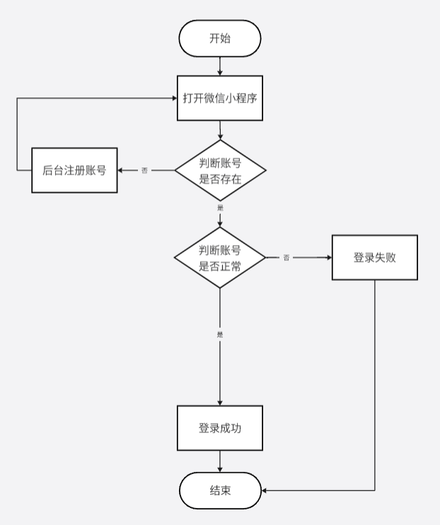

图5-1登录流程图

产品模块

小程序用户输入查询条件后，后台数据库会立即启动分页查询的过程。这一过程旨在优化数据检索和传输效率，以确保用户能够快速获得所需信息。在这个过程中，后台数据库会根据输入的查询条件，精确地筛选出相关数据，并按照预定的分页规则进行组织。然后，将查询结果以一种易于前端页面处理的格式返回。前端页面接收到查询结果后，会以直观、友好的方式呈现给用户，用户可以轻松浏览和操作返回的数据。

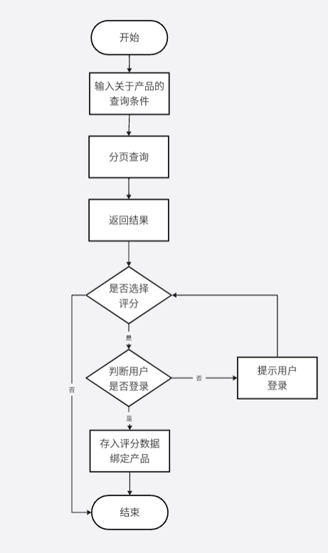

图5-2产品模块功能流程图

个人中心模块

用户通过底部导航栏进入个人中心模块，后台会迅速进行是否用户登录的判断。这一关键步骤对于保障用户信息的安全性和个性化体验至关重要，若系统确认用户已经登录，后台将立即返回用户发布的动态及评论信息。

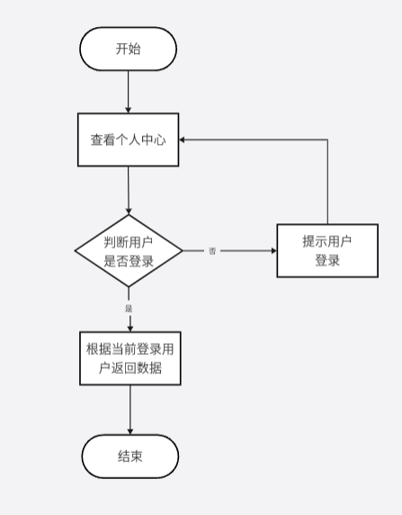

图5-3个人中心功能模块图

产品榜单模块

用户点击任一产品榜单，可以看到榜单产品评分信息，点击产品详情，可以看到产品成分信息等。用户可以自行选择是否评分评论，为了保证评分的真实性和有效性，用户需登录才能对产品进行评分评论。若用户登录，则存入用户评分的数据，后台会迅速处理评分数据，得到产品新的评分数据，以及新的评分排名榜单。若用户未登录，则提示用户登录，以确保他们能够充分参与到产品的评价过程中。

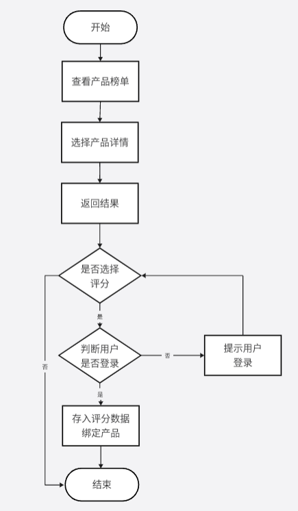

图5-4 产品榜单模块功能图

发布动态模块

用户点击动态，可以查看他人发布的动态，以及选择自己是否发布动态。如果用户选择发布动态按钮，此时后台会判断用户是否登录。若用户登录，则存入用户发布的动态数据到后台数据库，以便后续用户的管理和展示。若用户未登录，则提示用户登录，这是为了确保动态的发布者是真实的用户，同时也有助于维护平台的秩序和安全性。

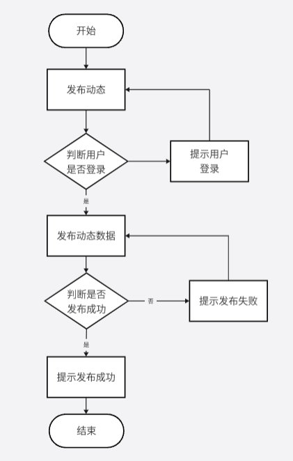

图5-5动态模块功能流程图

### 5.2后台

（1）注册登录

管理员登录需输入账号密码。

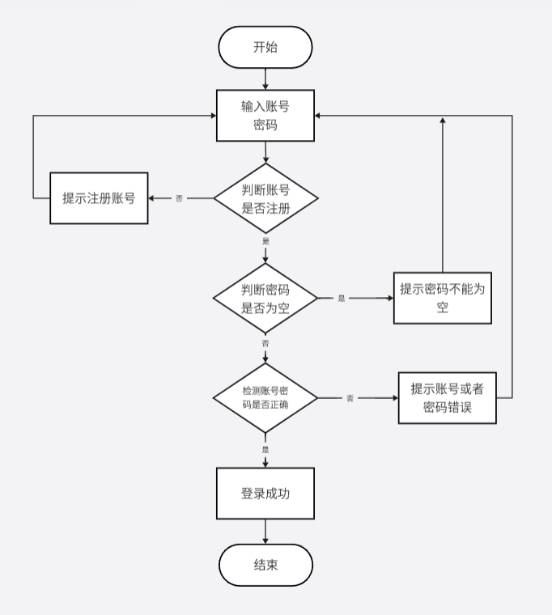

图5-6管理注册登录功能模块流程图

（2）管理各信息

管理员可以管理用户信息、产品榜单信息、产品分类信息、产品信息以及用户评论动态信息。

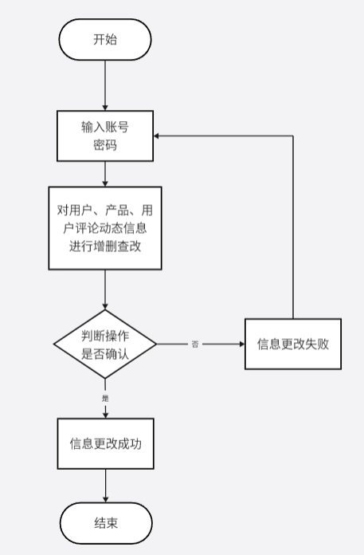

图5-7管理信息功能模块流程图

### 5.3本章小结

本章主要介绍了系统前台小程序登录、产品、个人中心等模块功能流程图和后台管理员的各功能模块流程图。

## 第6章 系统实现

### 6.1小程序

（1）登录

功能描述：用户打开微信小程序后，点击登录，系统将启动登录验证流程。若登录成功，用户将顺利进入小程序首页，开始享受各种功能和服务。若登录失败，系统会及时提示失败原因，以便用户了解问题所在。

逻辑说明：wxLogin方法实现微信登录流程。验证登录凭证后，向微信接口请求用户openId。若用户不存在，则创建新用户；若存在，检查其类型。成功则生成JWT token，设置认证信息至Spring Security上下文，并返回包含用户信息及token的LoginDto对象。异常情况下抛出ResultException。

登录核心代码：

<table>
<tr><td>public LoginDto wxLogin(String code) throws ResultException {  //登录凭证不能为空  if (code == null || code.isEmpty()) {  throw new ResultException(ResultStatus.NO_WX_CODE);  }  //请求参数  String params = &quot;appid=&quot; + WX_APPID + &quot;&amp;secret=&quot; + WX_SECRET + &quot;&amp;js_code=&quot; + code + &quot;&amp;grant_type=&quot; + GRANT_TYPE;  //发送请求  String openId = BaseFunction.sendGet(&quot;https://api.weixin.qq.com/sns/jscode2session&quot;, params);  List&lt;String&gt; roleList = new ArrayList&lt;&gt;();  roleList.add(&quot;ROLE_USER&quot;);  User wxUser = new User();  if (JSONObject.parseObject(openId, WxLoginDto.class).getOpenid() == null) {  throw new ResultException(ResultStatus.NO_WX_CODE);  } else {  wxUser.setOpenId(JSONObject.parseObject(openId, WxLoginDto.class).getOpenid());  //查看数据库中是否存在信息  if (userMapper.selectCount(new QueryWrapper&lt;User&gt;().eq(&quot;openId&quot;, wxUser.getOpenId())).equals(0)) {  //存入数据库中，当作登录成功，构造Token，并且存入本地缓存中  //初始化构造用户默认信息  wxUser.setNumber(wxUser.getOpenId());  wxUser.setType(CUSTOMER);  wxUser.setTime(new Date());  wxUser.setSex(MAN);  wxUser.setPhone(NEW_CUSTOMER_PHONE);  wxUser.setName(NEW_CUSTOMER);  userMapper.insert(wxUser);  } else {  wxUser = userMapper.selectOne(new QueryWrapper&lt;User&gt;().eq(&quot;openId&quot;, wxUser.getOpenId()));  if (wxUser.getType().equals(3)) {  throw new ResultException(ResultStatus.NOT_PASS_LOGIN);  }  }  // 生成 token  String token = JwtUtils.generateToken(wxUser.getOpenId(), roleList, false);   // 认证成功后，设置认证信息到 Spring Security 上下文中  Authentication authentication = JwtUtils.getAuthentication(token);  SecurityContextHolder.getContext().setAuthentication(authentication);  UserLocal.setUser(wxUser);  return new LoginDto(wxUser, SecurityConstants.TOKEN_PREFIX + token);  } }</td></tr>
</table>

查看首页信息

功能描述：用户登录成功后，呈现在眼前的是靓靓小程序的首页信息。其中涵盖了产品排行榜，让用户能快速了解热门产品，此外，还展示了部分产品信息及其评分信息。

逻辑说明：goodsPageByWx方法根据微信小程序的分页请求获取商品信息。首先创建分页对象，然后通过goodsMapper查询商品数据。查询结果中的每个商品，若包含图片和分类介绍信息，分别转换为列表和数组格式。最后，返回处理后的分页商品数据。

页面展示：

图6-1首页界面

小程序首页查看核心代码：

<table>
<tr><td>public Page&lt;?&gt; goodsPageByWx(GoodsPageWxVto goodsPageWxVto) {  Page&lt;GoodsDto&gt; page = new Page&lt;&gt;(goodsPageWxVto.getCurrent(), goodsPageWxVto.getSize());  IPage&lt;GoodsDto&gt; goodsDtoIPage = goodsMapper.selectGoodsByPageWx(page, goodsPageWxVto);  goodsDtoIPage.getRecords().forEach(goodsDto -&gt; {  if (goodsDto.getGoods().getImages() != null &amp;&amp; !goodsDto.getGoods().getImages().isEmpty()) {  goodsDto.getGoods().setGoodsPhotoList(stringToList(goodsDto.getGoods().getImages()));  }  if (goodsDto.getGoods().getSortIntroduce() != null &amp;&amp; !goodsDto.getGoods().getSortIntroduce().isEmpty()) {  goodsDto.getGoods().setSortIntroduces(JSON.parseArray(goodsDto.getGoods().getSortIntroduce(), GoodsIntroduceVto.class));  }  });  return (Page&lt;?&gt;) goodsDtoIPage; }</td></tr>
</table>

查看产品详情信息

功能描述：用户搜索后点击产品或直接从首页点进产品可以查看到产品图片信息、成分信息，以及主要成分功效介绍。

逻辑说明：goodsDetail方法通过商品ID获取商品详情。查询数据库后，若商品有图片信息，将其转换为列表；若有分类介绍，从JSON字符串转换为对象。计算该商品的评论总数并设置。最终返回包含商品信息、图片列表、分类介绍和评论总数的GoodsDto对象。

页面展示：

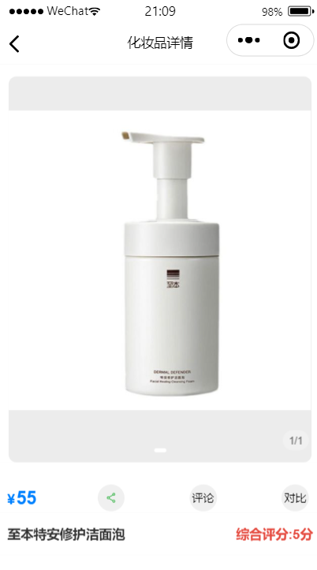

图6-2产品详情界面

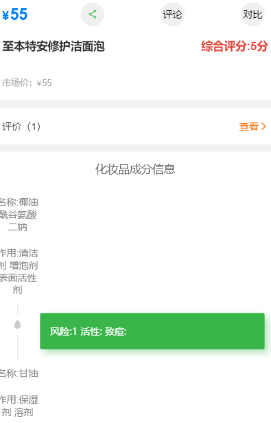

图6-3产品详情界面

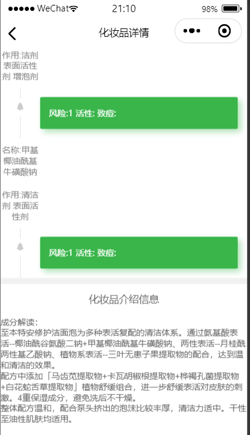

图6-4产品详情界面

核心代码：

<table>
<tr><td>public GoodsDto goodsDetail(Integer goodsId) {  GoodsDto goods = goodsMapper.selectGoodsByWxFromId(goodsId);  if (goods.getGoods().getImages() != null &amp;&amp; !goods.getGoods().getImages().isEmpty()) {  goods.getGoods().setGoodsPhotoList(stringToList(goods.getGoods().getImages()));  }  if (goods.getGoods().getSortIntroduce() != null &amp;&amp; !goods.getGoods().getSortIntroduce().isEmpty()) {  goods.getGoods().setSortIntroduces(JSON.parseArray(goods.getGoods().getSortIntroduce(), GoodsIntroduceVto.class));  }  goods.setCommentTotal(evaluationMapper.selectCount(new QueryWrapper&lt;Evaluation&gt;().eq(&quot;goods_id&quot;, goodsId)));  return goods; }</td></tr>
</table>

搜索产品

功能描述：用户只需输入自身需求，如“妆前”，系统便会迅速进行检索和匹配，从而查询到与之相关的产品列表信息。这使得用户能够便捷地获取到符合其特定需求的产品信息，节省了筛选时间。列表中可能会包含不同品牌、款式及功能的妆前产品，用户可以根据自身喜好和实际需求进行进一步的比较与选择。

逻辑说明：goodsList方法接收分页参数listVto，创建分页对象并查询商品列表。查询结果中的每个商品，若包含图片信息，转换为列表格式；若包含分类介绍，从JSON转换为对象。处理后的商品数据被封装在分页对象中并返回，为前端提供格式化的商品信息。

页面展示：

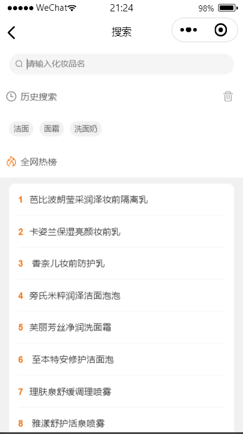

图6-5搜索产品界面

搜索查询核心代码

<table>
<tr><td>public Page&lt;?&gt; goodsList(ListVto listVto) {  Page&lt;GoodsDto&gt; page = new Page&lt;&gt;(listVto.getPage(), listVto.getPageSize());  IPage&lt;GoodsDto&gt; goodsDtoIPage = goodsMapper.selectGoodsByPage(page, listVto);  //循环数据转List&lt;Java&gt;  goodsDtoIPage.getRecords().forEach(goodsDto -&gt; {  if (goodsDto.getGoods().getImages() != null &amp;&amp; !goodsDto.getGoods().getImages().isEmpty()) {  goodsDto.getGoods().setGoodsPhotoList(stringToList(goodsDto.getGoods().getImages()));  }  if (goodsDto.getGoods().getSortIntroduce() != null &amp;&amp; !goodsDto.getGoods().getSortIntroduce().isEmpty()) {  goodsDto.getGoods().setSortIntroduces(JSON.parseArray(goodsDto.getGoods().getSortIntroduce(), GoodsIntroduceVto.class));  }  });  return (Page&lt;GoodsDto&gt;) goodsDtoIPage; }</td></tr>
</table>

查看产品分类信息及分类查询

功能描述：用户点击底部导航栏的分类选项，可查看到详尽的美妆护肤产品分类信息，能快速找到所需产品类别。

逻辑说明：首先，classTree方法从数据库中查询所有分类，然后调用buildByRecursive方法来构建树形结构。buildByRecursive方法找出所有顶级分类（parentId为0），并为每个顶级分类递归调用findChildren方法来收集其所有子分类。findChildren方法遍历分类列表，找出当前节点的直接子节点，并递归地为每个子节点收集其子节点，最终形成完整的分类树。

页面展示：

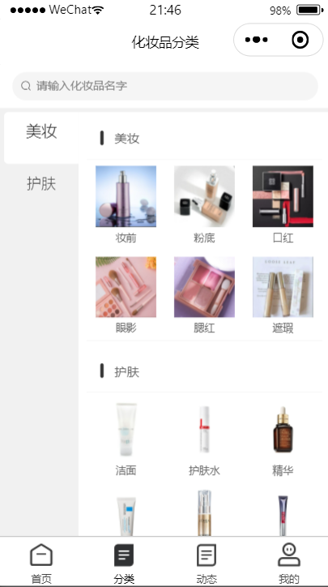

图6-6产品分类信息界面

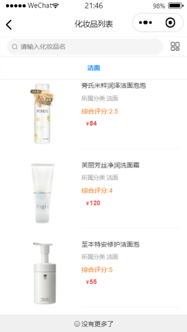

图6-7洁面界面

核心代码：

<table>
<tr><td>public List&lt;Class&gt; classTree() {  List&lt;Class&gt; classList = classMapper.selectList(new QueryWrapper&lt;Class&gt;());  return buildByRecursive(classList); } /**  * 使用递归方法建树  *  * @param treeNodes  * @return  */ public static List&lt;Class&gt; buildByRecursive(List&lt;Class&gt; treeNodes) {  List&lt;Class&gt; trees = new ArrayList&lt;Class&gt;();  for (Class treeNode : treeNodes) {  if (treeNode.getParentId()==0) {  trees.add(findChildren(treeNode, treeNodes));  }  }  return trees;} /**  * 递归查找子节点  *  * @param treeNodes  * @return  */ public static Class findChildren(Class treeNode, List&lt;Class&gt; treeNodes) {  for (Class it : treeNodes) {  if (treeNode.getId().equals(it.getParentId())) {  if (treeNode.getChildren() == null) {  treeNode.setChildren(new ArrayList&lt;Class&gt;());  }  treeNode.getChildren().add(findChildren(it, treeNodes));  }  }  return treeNode; }</td></tr>
</table>

查看排行榜功能

功能描述：用户可以查看首页排行榜以及更多榜单的信息。

逻辑说明：从微信小程序获取所有榜单的列表。当用户向honorGet路径发送一个HTTP GET请求时，后端服务会执行honorService.list()方法，这个方法会查询数据库中的榜单信息，并将这些信息以Honor对象列表的形式返回给用户。

页面展示：

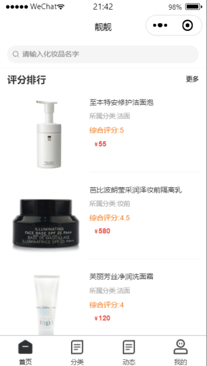

图6-8首页排行界面

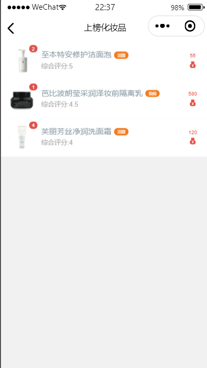

图6-9更多榜单界面

核心代码：

<table>
<tr><td>@GetMapping(&quot;/honorGet&quot;) public List&lt;Honor&gt; honorGet() {  return honorService.list(); } @GetMapping(&quot;/honorGoods/{id}&quot;) public List&lt;Goods&gt; honorGoods(@PathVariable(&quot;id&quot;) Integer id) {  List&lt;HonorGoods&gt; honorGoods = honorGoodsService.listByGoodsScore(id);  return honorGoods.stream().map(x -&gt; {  Goods goods = goodsService.getById(x.getGoodsId());  goods.setReason(x.getReason());  goods.setGoodsPhotoList(Arrays.asList(goods.getImages().split(&quot;,&quot;)));  goods.setOrders(x.getOrders());  goods.setClassName(classService.getById(goods.getClassId()).getName());  goods.setScore(x.getScore());  return goods;  }).collect(Collectors.toList()); }</td></tr>
</table>

评论评分功能

功能描述：用户点击产品详情后，点击评分可以对产品进行评分、以及评论产品，并且选择是否上传图片。

逻辑说明：RESTful接口，用于处理用户通过POST请求提交的评价评分，它会记录评价时间、当前登录用户的ID，并保存评价到数据库。

页面展示：

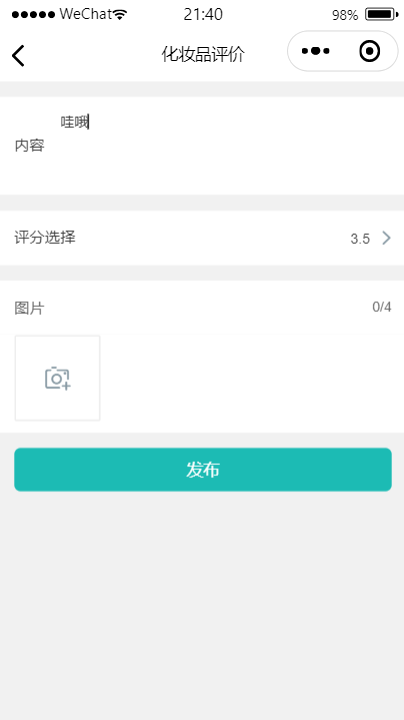

图6-10用户发布评分

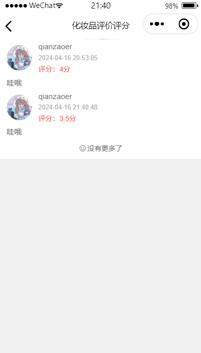

图6-11用户发布评分成功

核心代码：

<table>
<tr><td>@Transactional(rollbackFor = Exception.class) @PostMapping(&quot;/orderCv&quot;) public void orderCv(@RequestBody Evaluation evaluation) { evaluation.setTime(new Date()); evaluation.setUserId(UserLocal.getUser().getId()); evaluationService.save(evaluation); }</td></tr>
</table>

对比产品功能

功能描述：点击某一产品的详情信息点击对比，选择想对比的产品会得出产品价格以及产品评分信息对比结果和成分信息的对比展示。

逻辑说明：checkProduct方法通过商品ID比较两个商品。接收两个路径变量pid和id作为商品ID，分别调用goodsService获取这两个商品的详细信息。使用compareGoods方法进行比较，并将比较结果以及两个商品的详细信息存入Map对象中返回，然后前端可以展示两个商品的对比结果和各自的详细信息。

页面展示：

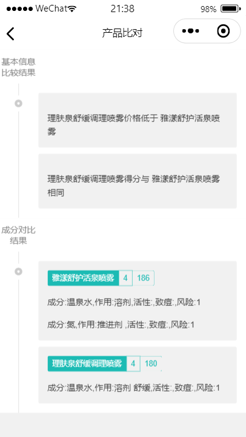

图6-12产品对比界面

核心代码：

<table>
<tr><td>@GetMapping(&quot;/checkProduct/{pid}/{id}&quot;) public Map checkProduct(@PathVariable(&quot;pid&quot;) Integer pid, @PathVariable(&quot;id&quot;) Integer id) {  Map&lt;String, Object&gt; map = new HashMap&lt;&gt;();  GoodsDto product = goodsService.goodsDetail(pid);  GoodsDto goods = goodsService.goodsDetail(id);  //进行比较，返回比较后的结果  map.put(&quot;result&quot;, compareGoods(product, goods));  map.put(&quot;product&quot;, product);  map.put(&quot;goods&quot;, goods);  return map; }</td></tr>
</table>

发布动态功能

功能描述：用户点击底部导航栏的动态，选择发布动态，可以输入文字图片，发布动态。

逻辑说明：用户发布动态内容。它从请求体接收一个Forum对象，设置发布者ID、当前时间，并初始化评论和浏览计数。如果提供了图片列表，它将转换为字符串格式。最后，通过forumService保存动态到数据库，完成发布过程。

页面展示：

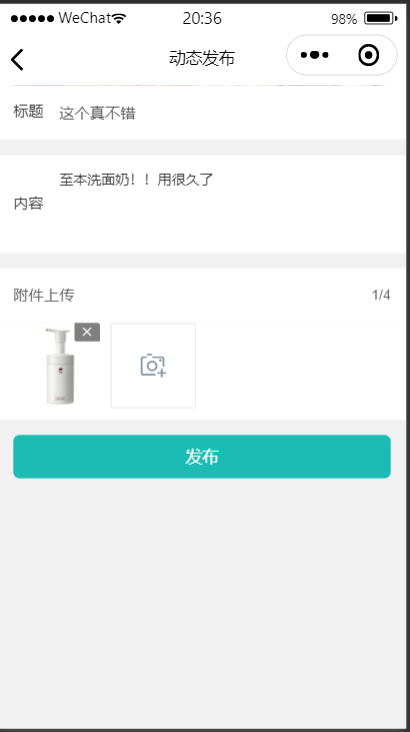

图6-14发布动态界面

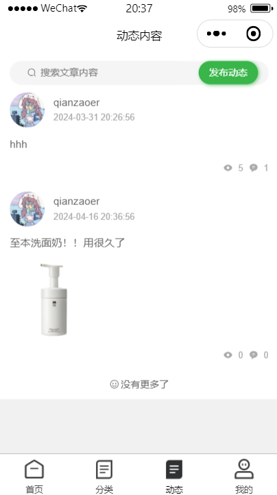

图6-15发布动态成功界面

核心代码：

<table>
<tr><td>@PostMapping(&quot;/forum&quot;) public void forum(@RequestBody Forum forum) {  forum.setUserId(Objects.requireNonNull(UserLocal.getUser()).getId());  //如果没图片就转换写上去  if (forum.getPicList() != null) {  forum.setPic(!forum.getPicList().isEmpty() ? listToString(forum.getPicList()) : &quot;&quot;);  }  forum.setTime(new Date());  forum.setComment(0);  forum.setView(0);  forumService.save(forum); }</td></tr>
</table>

查看我的评论动态功能

功能描述：点击底部导航栏的个人中心，可以查看自己发布过的评论动态，并且可以直接跳转至动态、评论详情界面。

逻辑说明：通过UserLocal.getUser()获取当前用户对象。然后，构建一个QueryWrapper查询条件，指定评论的用户ID等于当前用户ID。使用evaluationService.list()方法，根据这个查询条件获取评论列表。对于列表中每个评论，通过userService.getById()获取评论用户信息并设置。

页面展示：

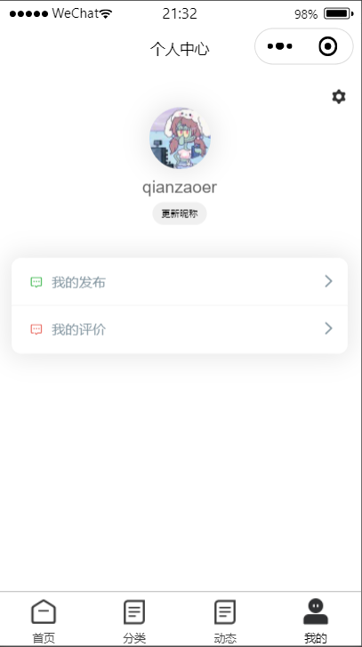

图6-16个人中心界面

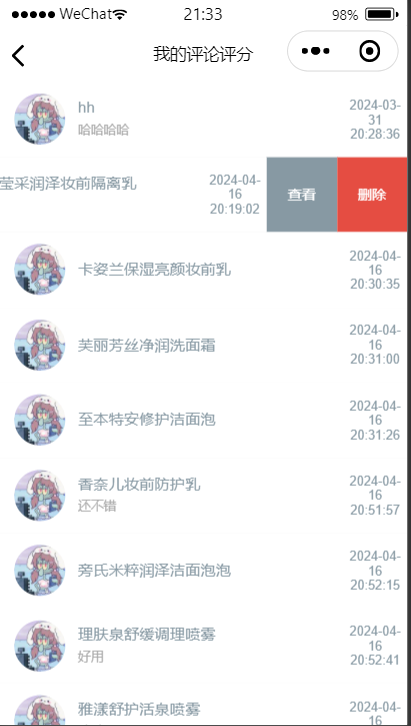

图6-17查看我的评分界面

核心代码：

<table>
<tr><td>@GetMapping(&quot;/myComment&quot;) public List&lt;Evaluation&gt; myComment() {  User user = UserLocal.getUser();  QueryWrapper&lt;Evaluation&gt; evaluationQueryWrapper = new QueryWrapper&lt;&gt;();  evaluationQueryWrapper.eq(&quot;user_id&quot;, user.getId());  List&lt;Evaluation&gt; evaluations = evaluationService.list(evaluationQueryWrapper);  evaluations.forEach(x -&gt; {  x.setEvUser(userService.getById(x.getUserId()));  if (x.getType().equals(0)) {  x.setTitleName(goodsService.getById(x.getGoodsId()).getName());  } else {  x.setTitleName(forumService.getById(x.getGoodsId()).getTitle());  }  });  return evaluations; }</td></tr>
</table>

### 6.2后台

登录

功能描述：管理员通过输入账号密码登录后台管理系统，若账号不存在则提示请求错误。

逻辑说明：authLogin方法实现账号认证登录。接收LoginVto对象，提取账号和MD5加密后的密码。查询数据库验证账号是否存在，若不存在或密码错误，抛出异常。验证成功后，检查用户是否允许登录。为用户分配角色并生成JWT token。设置认证信息至Spring Security上下文和Redis缓存，注入用户基本信息，并返回包含用户信息和token的LoginDto对象。

页面展示：

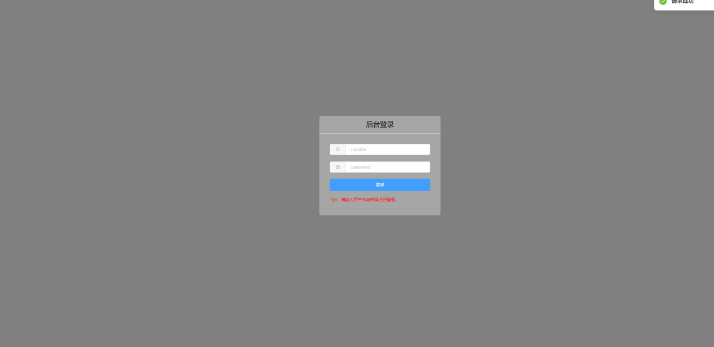

图6-18 管理员登录界面

核心代码：

<table>
<tr><td>/**  * 用户登录认证  *  * @param loginVto 用户登录信息  */ private LoginDto authLogin(LoginVto loginVto) throws ResultException {  String userName = loginVto.getNumber();  String password = getMD5(loginVto.getPassword());   // 根据登录账号获取用户信息  User user = userMapper.selectOne(new QueryWrapper&lt;User&gt;().eq(&quot;number&quot;, userName));  if (user == null) {  throw new ResultException(ResultStatus.ERROR_NUM_PWD);  }  // 验证登录密码是否正确。如果正确，则赋予用户相应权限并生成用户认证信息  if (this.bCryptPasswordEncoder.matches(password, user.getPassword())) {  if (user.getType().equals(NOLOGIN)) {  throw new ResultException(ResultStatus.NOT_PASS_LOGIN);  }  List&lt;String&gt; roleList = new ArrayList&lt;&gt;();  roleList.add(&quot;ROLE_USER&quot;);  // 生成 token  String token = JwtUtils.generateToken(userName, roleList, false);   // 认证成功后，设置认证信息到 Spring Security 上下文中  Authentication authentication = JwtUtils.getAuthentication(token);  SecurityContextHolder.getContext().setAuthentication(authentication);  //存入Redis,下载鉴权  String key = bCryptPasswordEncoder.encode(getMD5(new Date().toString())).replaceAll(&quot;/&quot;, &quot;&quot;);  redisUtil.setCacheObject(key, user, 2, TimeUnit.HOURS);  //注入当前用户的基本信息  UserLocal.setUser(user);  return new LoginDto(user, SecurityConstants.TOKEN_PREFIX + token);  }  throw new ResultException(ResultStatus.ERROR_NUM_PWD); }</td></tr>
</table>

查看分类列表信息

功能描述：管理员登录后后台管理系统后查看产品列表信息。

逻辑说明：classList方法用于获取分类列表，支持分页和根据分类ID筛选。首先创建分页对象，然后构建查询条件，包括根据传入的classId筛选子分类或特定分类。执行数据库查询后，如果结果非空，递归构建分类树形结构，并更新分页对象中的记录和总数，最终返回包含分类树的分页对象。

页面展示：

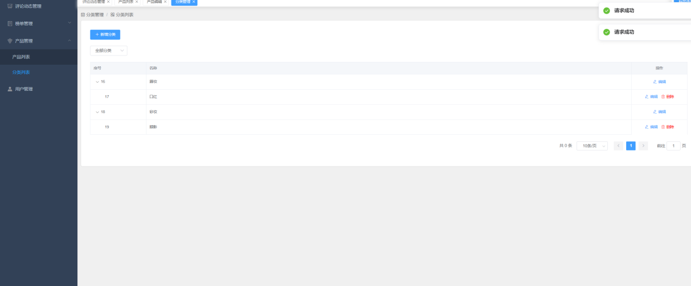

图6-19 分类列表界面

核心代码：

<table>
<tr><td>public Page&lt;?&gt; classList(ListVto listVto) {  Page&lt;Class&gt; page = new Page&lt;&gt;(listVto.getPage(), listVto.getPageSize());  QueryWrapper&lt;Class&gt; queryWrapper = new QueryWrapper&lt;&gt;();  queryWrapper.eq(listVto.getClassId() != null, &quot;parent_id&quot;, listVto.getClassId());  queryWrapper.or(listVto.getClassId() != null).eq(listVto.getClassId() != null, &quot;id&quot;, listVto.getClassId());  Page&lt;Class&gt; classIPage = classMapper.selectPage(page, queryWrapper);  if (classIPage.getTotal() != 0) {  classIPage.setRecords(buildByRecursive(classIPage.getRecords()));  classIPage.setTotal(classIPage.getRecords().stream().filter(x -&gt; x.getParentId() == null).count()); }  return classIPage;}</td></tr>
</table>

管理产品列表数据

功能描述：添加、编辑产品功能，添加产品的分类信息、名称信息、价格信息以及主要成分信息和成分功效信息介绍、相关图片。

逻辑说明：operationGoods方法用于处理商品数据的增删改操作，将商品图片列表转换为字符串，非空则更新images属性，空则清空。商品分类介绍转换为JSON字符串存入sortIntroduce属性。根据operationType执行相应操作：UPDATE则更新商品记录，DELETE则删除商品，ADD则插入新商品。

页面展示：

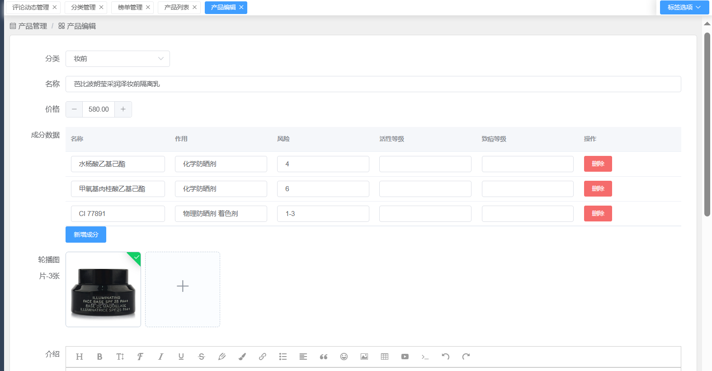

图6-20 管理产品列表界面

核心代码：

<table>
<tr><td>@Override @Transactional(rollbackFor = Exception.class) public void operationGoods(Goods goods, Integer operationType) {  if (goods.getGoodsPhotoList() != null) {  goods.setImages(!goods.getGoodsPhotoList().isEmpty() ? listToString(goods.getGoodsPhotoList()) : &quot;&quot;);  }  //转JSON  goods.setSortIntroduce(JSON.toJSONString(goods.getSortIntroduces()));  if (Objects.equals(operationType, UPDATE)) {  goodsMapper.updateById(goods);  } else if (Objects.equals(operationType, DELETE)) {  //化妆品删除  goodsMapper.deleteById(goods);  } else if (Objects.equals(operationType, ADD)) {  goodsMapper.insert(goods);  } }</td></tr>
</table>

管理用户、管理员数据

功能描述：后台增加管理员信息包括账号名、密码，以及查看小程序用户登录信息，还可以选择禁止该用户登录小程序。

逻辑说明：userList方法根据分页参数listVto和查询条件从数据库中检索用户列表，返回分页对象Page<?>，包含查询结果。operationUser方法处理用户信息的增删改操作。根据operationType参数，执行更新用户状态、修改密码、更新用户信息、注册新用户或删除用户操作。

页面展示：

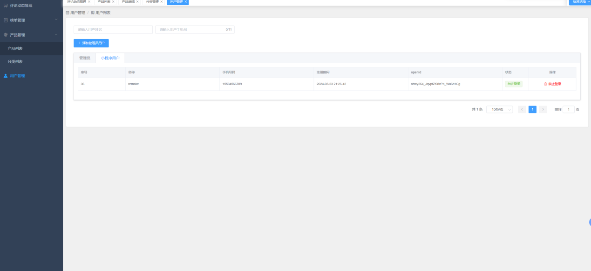

图6-21 用户数据界面

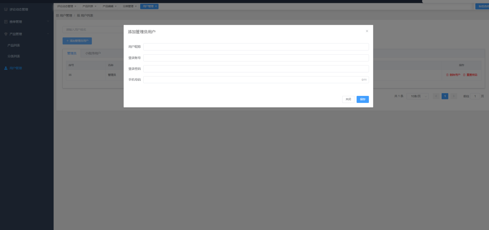

图6-22 添加管理员界面

核心代码：

<table>
<tr><td>public Page&lt;?&gt; userList(ListVto listVto) throws ResultException {  return userMapper.selectUserByPage(new Page&lt;&gt;(listVto.getPage(), listVto.getPageSize()), listVto); } &lt;select id=&quot;selectUserByPage&quot; resultType=&quot;com.shop.back.api.entity.User&quot;&gt;  select * from `user`  where 1=1  &lt;if test=&quot;listVto.phone!=null and listVto.phone !=&#x27;&#x27;&quot;&gt;  and phone like CONCAT(&#x27;%&#x27;,#{listVto.phone},&#x27;%&#x27;)  &lt;/if&gt;  &lt;if test=&quot;listVto.userName!=null and listVto.userName !=&#x27;&#x27;&quot;&gt;  and name like CONCAT(&#x27;%&#x27;,#{listVto.userName},&#x27;%&#x27;)  &lt;/if&gt;  &lt;if test=&quot;listVto.userType==0&quot;&gt;  and openId is not null  &lt;/if&gt;  &lt;if test=&quot;listVto.userType==1&quot;&gt;  and `type` =1  &lt;/if&gt; &lt;/select&gt; 编辑： @Override @Transactional public void operationUser(User user, Integer operationType) throws ResultException {  User dbUser = userMapper.selectById(user.getId());  Integer status = 1;  if (Objects.equals(operationType, USER_NO_LOGIN)) {  user.setType(NOLOGIN);  //修改状态  userMapper.updateById(user);  } else if (Objects.equals(operationType, USER_LOGIN)) {  user.setType(CUSTOMER);  userMapper.updateById(user);  } else if (Objects.equals(operationType, USER_PASSWORD)) {  user.setPassword(bCryptPasswordEncoder.encode(getMD5(&quot;123456&quot;)));  userMapper.updateById(user);  } else if (Objects.equals(operationType, USER_UPDATE)) {  //防止请求工具  user.setType(dbUser.getType());  if (!user.getPassword().equals(dbUser.getPassword())) {  //密码修改  user.setPassword(bCryptPasswordEncoder.encode(getMD5(user.getPassword())));  status = 2;  }  if (!user.getNumber().equals(dbUser.getNumber())) {  if (userMapper.selectOne(new QueryWrapper&lt;User&gt;().eq(&quot;number&quot;, user.getNumber())) != null) {  throw new ResultException(ResultStatus.NUM);  }  }  //直接修改  userMapper.updateById(user);  if (status == 2) {  //强制退出，重新登录  SecurityContextHolder.clearContext();  throw new ResultException(ResultStatus.NO_LOGIN);  }  } else if (Objects.equals(operationType, USER_ADD)) {  //新增走注册接口  register(user);  } else if (Objects.equals(operationType, USER_DELETE)) {  userMapper.deleteById(user.getId());  } }</td></tr>
</table>

管理分类数据

功能描述：管理员可以在后台添加、删除产品类别以及添加、删除子集产品。

逻辑说明：operationClass方法负责根据操作类型operationType对分类aClass进行增删改操作。若操作类型为ADD，则向数据库中插入新分类；若为UPDATE，则更新指定分类的信息；若为DELETE，则删除指定分类。该方法直接通过classMapper执行相应的数据库操作。

页面展示：

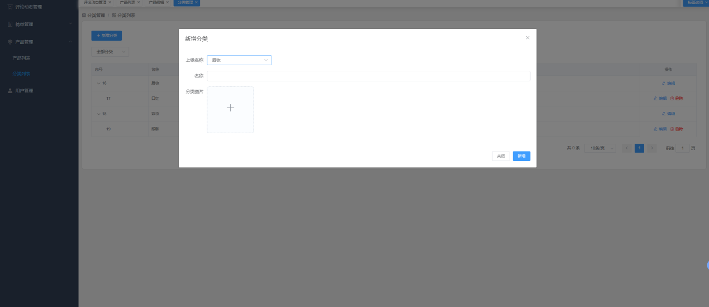

图6-23添加分类界面

核心代码：

<table>
<tr><td>新增： @Override public void operationClass(Class aClass, Integer operationType) {  //只能修改名称  if (operationType == ADD) {  classMapper.insert(aClass);  } else if (operationType == UPDATE) {  classMapper.updateById(aClass);  } else if (operationType == DELETE) {  classMapper.deleteById(aClass);  } }</td></tr>
</table>

榜单管理

功能描述：后台可以新增产品榜单、删除产品榜单、以及对榜单产品进行添加删除、添加操作。

逻辑说明：此方法根据operationType参数对榜单上的产品推荐数据进行管理：若为添加（operationConstants.ADD），则保存新数据；若为更新（operationConstants.UPDATE），则更新现有产品推荐数据；若为删除（operationConstants.DELETE），则删除该产品的推荐数据及其相关的数据记录。

页面展示：

图6-24榜单管理界面

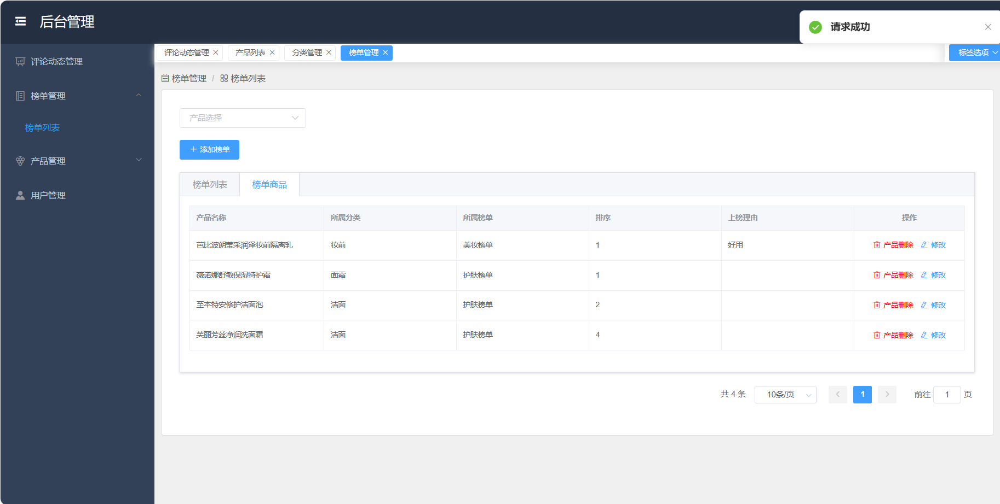

图6-25榜单产品管理界面

核心代码：

<table>
<tr><td>public void operationHonor(Honor honor, Integer operationType) {  if (Objects.equals(operationType, operationConstants.ADD)) {  this.save(honor);  } else if (Objects.equals(operationType, operationConstants.UPDATE)) {  this.updateById(honor);  } else if (Objects.equals(operationType, operationConstants.DELETE)) {  this.removeById(honor.getId());  //删除榜单下的数据  honorGoodsMapper.delete(new QueryWrapper&lt;HonorGoods&gt;().eq(&quot;honor_id&quot;, honor.getId()));  }  } }</td></tr>
</table>

查看产品列表

功能描述：管理员登录后台，可以查看产品列表信息。

逻辑说明：goodsList方法用于获取商品列表，支持分页和条件筛选，根据ListVto对象中的页码和每页大小创建分页对象，然后通过goodsMapper查询商品数据。查询结果中的商品图片和分类介绍信息被转换为更易处理的格式。最后，返回包含处理后商品数据的分页对象。

页面展示：

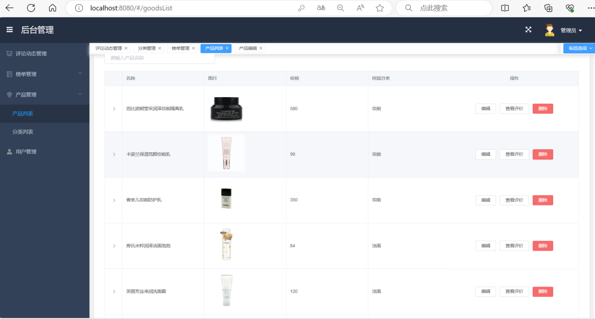

图6-26产品列表界面

核心代码：

<table>
<tr><td>public Page&lt;?&gt; goodsList(ListVto listVto) {  Page&lt;GoodsDto&gt; page = new Page&lt;&gt;(listVto.getPage(), listVto.getPageSize());  IPage&lt;GoodsDto&gt; goodsDtoIPage = goodsMapper.selectGoodsByPage(page, listVto);  //循环数据转List&lt;Java&gt;  goodsDtoIPage.getRecords().forEach(goodsDto -&gt; {  if (goodsDto.getGoods().getImages() != null &amp;&amp; !goodsDto.getGoods().getImages().isEmpty()) { goodsDto.getGoods().setGoodsPhotoList(stringToList(goodsDto.getGoods().getImages())); }  if (goodsDto.getGoods().getSortIntroduce() != null &amp;&amp; !goodsDto.getGoods().getSortIntroduce().isEmpty()) { goodsDto.getGoods().setSortIntroduces(JSON.parseArray(goodsDto.getGoods().getSortIntroduce(), GoodsIntroduceVto.class));  } });  return (Page&lt;GoodsDto&gt;) goodsDtoIPage}</td></tr>
</table>

评论动态管理

功能描述：管理员登录后台，可以查看并管理小程序用户的评论动态信息。

逻辑说明：forumList方法根据用户输入的搜索关键词，从数据库中检索论坛版块列表，并支持分页显示。对于每个版块，如果存在图片，将其分割成列表形式；同时获取版块创建者的用户信息，并关联到版块对象上。最终返回包含版块信息和用户信息的分页结果。

页面展示：

图6-27评论管理界面

图6-28评论删除成功界面

核心代码：

<table>
<tr><td>public Page&lt;?&gt; forumList(ListVto listVto) {  QueryWrapper&lt;Forum&gt; forumQueryWrapper = new QueryWrapper&lt;&gt;();  if (StringUtils.isNotBlank(listVto.getLikeName())) {  forumQueryWrapper.like(&quot;info&quot;, listVto.getLikeName()); }  Page&lt;Forum&gt; forumPage = this.page(new Page&lt;Forum&gt;(listVto.getPage(), listVto.getPageSize()), forumQueryWrapper);  forumPage.getRecords().forEach(forum -&gt; {  if (StringUtils.isNotBlank(forum.getPic())) {  forum.setPicList(Arrays.asList(forum.getPic().split(&quot;,&quot;)));  }  User user = userMapper.selectById(forum.getUserId());  forum.setUser(user);  });  return forumPage; }</td></tr>
</table>

产品评论管理

功能描述：管理员可以对用户产品评价进行查看删除等操作。

逻辑说明：goodsCommentPage方法根据商品ID和分页参数获取评论列表，创建分页对象后，查询数据库中的评论并封装为CommentDto。对于每条评论，如果存在图片，将其路径分割成列表。返回包含处理后的评论数据的分页对象。

页面展示：

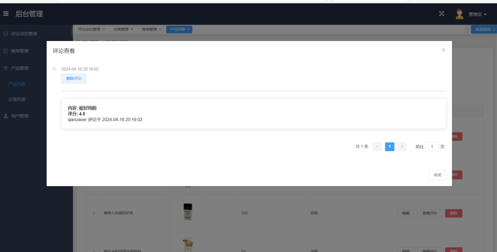

图6-29查看产品评论界面

核心代码：

<table>
<tr><td>@Override public Page&lt;CommentDto&gt; goodsCommentPage(WxPageVto wxPageVto) {  Page&lt;CommentDto&gt; commentDtoPage = evaluationMapper.goodsCommentPage(new Page&lt;CommentDto&gt;(wxPageVto.getCurrent(), wxPageVto.getSize()), wxPageVto.getGoodsId());  commentDtoPage.getRecords().forEach(x -&gt; {  if (x.getPic() != null) {  x.setPicList(Arrays.asList(x.getPic().split(&quot;,&quot;)));  }  });  return commentDtoPage;}</td></tr>
</table>

### 6.3本章小结

本章主要介绍了系统小程序功能模块和后台功能模块实现的部分界面和简单的功能描述，并对相关核心代码及其逻辑说明进行了简单阐述。

## 第7章 系统测试

### 7.1测试概述

系统测试是软件测试过程中的重要环节，对于确保软件系统的质量和稳定性、提高用户满意度、降低维护成本、提高开发效率以及遵循标准和规范等方面都具有至关重要的作用。系统测试是软件测试过程中不可或缺的关键环节，它对于确保软件系统的质量和稳定性至关重要，只有经过严格的测试，才能发现潜在的问题和错误，并及时加以修复。通过系统测试，能够提高用户的满意度。一个稳定、可靠的软件系统将为用户提供更好的使用体验，从而增强用户对软件的信任和满意度。同时，它还可以降低维护成本。在软件发布后，缺陷越少，维护成本就越低。系统测试有助于提高开发效率。它可以在早期发现问题，避免在后期花费更多的时间和精力来修复。

此外，遵循标准和规范也是其重要作用之一。这有助于确保软件系统的兼容性和互操作性，便于与其他系统进行集成。综上所述，系统测试在软件开发过程中扮演着关键的角色，对于确保软件系统的质量、稳定性、用户满意度以及开发效率都具有重要意义。

### 7.2测试方法

常用的测试方法包括白盒测试和黑盒测试。在本系统中，我们选择了黑盒测试。黑盒测试，又称功能测试，它着重于检测每个功能是否能够正常使用。这种测试方法是从用户的角度出发，依据输入数据与输出数据的对应关系进行测试。

黑盒测试不需要深入了解系统的内部结构和代码实现，而是关注系统的外部表现和功能特性。其优势在于：能够全面评估系统的功能完整性，发现与用户需求不符合的问题；可以有效验证系统的边界条件和异常情况处理能力；适用于不同复杂度的系统，具有较高的通用性。通过黑盒测试，能够确保系统在各种输入条件下都能正常工作，提供可靠的功能。它有助于提高系统的质量和稳定性，增强用户对系统的信心。然而，黑盒测试也存在一些局限性，例如无法检测到系统内部的逻辑错误。在实际应用中，通常会结合其他测试方法，以提高测试的效果和覆盖范围。

### 7.3测试内容

### 7.3.1小程序

用户登录功能测试

表7.1 用户登录功能测试

<table>
<tr><td>用例编号</td><td>执行步骤</td><td>预期结果</td><td>实际结果</td></tr>
<tr><td>1</td><td>1.用户打开微信小程序 2.选择扫码登录</td><td>登录成功</td><td>登录成功</td></tr>
</table>

用户查看信息功能测试

表7.2 用户查看信息功能测试

<table>
<tr><td>用例编号</td><td>执行步骤</td><td>预期结果</td><td>实际结果</td></tr>
<tr><td>1</td><td>1.用户登录小程序 2.在首页查看产品分类信息</td><td>成功查看到 产品分类信息</td><td>成功查看到 产品分类信息</td></tr>
<tr><td>2</td><td>用户点击任一产品 查看产品信息</td><td>成功查看到 产品详情信息</td><td>成功查看到 产品详情信息</td></tr>
<tr><td>3</td><td>1.用户点击【我的】</td><td>成功看到个人信息</td><td>成功看到个人信息</td></tr>
<tr><td>4</td><td>用户点击【动态】 查看动态信息</td><td>成功看到动态评论信息</td><td>成功看到动态评论信息</td></tr>
<tr><td>5</td><td>用户点击更多 点击美妆榜单</td><td>成功看到美妆榜单信息</td><td>成功看到美妆榜单信息</td></tr>
</table>

用户搜索产品功能测试

表7.3 用户搜索产品功能测试

<table>
<tr><td>用例编号</td><td>执行步骤</td><td>预期结果</td><td>实际结果</td></tr>
<tr><td>1</td><td>1.用户点击搜索框 2.搜索查询的产品</td><td>成功看到查询结果</td><td>成功看到查询结果</td></tr>
</table>

用户发布动态功能测试

表7.4 用户发布动态功能测试

<table>
<tr><td>用例编号</td><td>执行步骤</td><td>预期结果</td><td>实际结果</td></tr>
<tr><td>1</td><td>1.用户点击【发布】按钮 2.输入文字 3.选择是否插入图片</td><td>动态发布成功</td><td>动态发布成功</td></tr>
</table>

用户对产品评分功能测试

表7.5 用户对产品评分功能测试

<table>
<tr><td>用例编号</td><td>执行步骤</td><td>预期结果</td><td>实际结果</td></tr>
<tr><td>1</td><td>1.用户选择产品 2.对产品进行评分</td><td>评分成功</td><td>评分成功</td></tr>
</table>

产品对比功能测试

表7.6 产品对比功能测试

<table>
<tr><td>用例编号</td><td>执行步骤</td><td>预期结果</td><td>实际结果</td></tr>
<tr><td>1</td><td>1.用户点击产品 2.点击对比 3.选择对比对象</td><td>返回对比界面</td><td>返回对比界面</td></tr>
</table>

### 7.3.2后台

管理员登录功能测试

表7.7 管理员登录测试

<table>
<tr><td>用例编号</td><td>执行步骤</td><td>预期结果</td><td>实际结果</td></tr>
<tr><td>1</td><td>1.管理员打开后台管理登录界面 2.输入账号密码 3.点击【登录】按钮</td><td>登录成功， 跳转到页面</td><td>登录成功， 跳转到页面</td></tr>
</table>

管理员查看各信息功能测试

表7.8 管理员查看各信息功能测试

<table>
<tr><td>用例编号</td><td>执行步骤</td><td>预期结果</td><td>实际结果</td></tr>
<tr><td>1</td><td>1.管理员进入页面 2.点击【用户】按钮 3.查看用户信息</td><td>成功查看用户信息</td><td>成功查看用户信息</td></tr>
<tr><td>2</td><td>1.点击【产品】按钮 2.查看产品信息</td><td>成功查看产品信息</td><td>成功查看产品信息</td></tr>
<tr><td>3</td><td>1.点击【榜单】按钮 2.查看产品榜单信息</td><td>成功查看榜单信息</td><td>成功查看榜单信息</td></tr>
<tr><td>4</td><td>1.点击【评论动态】按钮 2.查看产品评论动态信息</td><td>成功查看评论动态信息</td><td>成功查看评论动态信息</td></tr>
</table>

管理员更新产品信息功能测试

表7.9 管理员更新产品信息功能测试

<table>
<tr><td>用例编号</td><td>执行步骤</td><td>预期结果</td><td>实际结果</td></tr>
<tr><td>1</td><td>1.管理员点击产品列表 2.点击编辑 3.输入更改的内容 4.点击保存</td><td>产品信息更新成功</td><td>产品信息更新成功</td></tr>
</table>

添加管理员信息功能测试

表7.10 添加管理员信息功能测试

<table>
<tr><td>用例编号</td><td>执行步骤</td><td>预期结果</td><td>实际结果</td></tr>
<tr><td>1</td><td>1.点击添加管理员 2.输入账号密码等信息 3.点击保存</td><td>管理员添加成功</td><td>管理员添加 成功</td></tr>
</table>

管理产品功能测试

表7.11 管理产品功能测试

<table>
<tr><td>用例编号</td><td>执行步骤</td><td>预期结果</td><td>实际结果</td></tr>
<tr><td>1</td><td>点击产品列表 点击添加产品 输入产品信息</td><td>添加产品成功</td><td>添加产品成功</td></tr>
<tr><td>2</td><td>1.点击产品列表 2.点击删除产品 3.确认</td><td>删除产品成功</td><td>删除产品成功</td></tr>
</table>

管理产品榜单功能

表7.12 管理产品榜单功能测试

<table>
<tr><td>用例编号</td><td>执行步骤</td><td>预期结果</td><td>实际结果</td></tr>
<tr><td>1</td><td>点击榜单列表 删除榜单 确认</td><td>榜单删除成功</td><td>榜单删除成功</td></tr>
<tr><td>2</td><td>点击榜单列表 添加榜单 确认</td><td>榜单添加成功</td><td>榜单添加成功</td></tr>
<tr><td>3</td><td>点击添加产品 选择产品</td><td>榜单产品添加成功</td><td>榜单产品添加成功</td></tr>
</table>

管理产品分类功能

表7.13 管理产品分类功能测试

<table>
<tr><td>用例编号</td><td>执行步骤</td><td>预期结果</td><td>实际结果</td></tr>
<tr><td>1</td><td>1.点击分类列表 2.删除分类 3.确认</td><td>分类删除成功</td><td>分类删除成功</td></tr>
<tr><td>2</td><td>1.点击分类列表 2.点击添加分类 3.输入分类信息</td><td>分类添加成功</td><td>分类添加成功</td></tr>
</table>

### 7.4本章小结

本章主要为系统测试，通过对系统小程序端和后台端进行功能测试，确保系统能够正确地运行和稳定地工作。以及确保靓靓小程序功能和性能符合用户的期望，给用户提供便捷、高效的美妆产品成分查询与评分微信小程序。

## 第8章 总结与展望

### 8.1 工作总结

本文主要完成了“靓靓”——美妆产品成分查询与评分小程序的设计与实现。长达一年的毕业设计，最终完成了。小程序的功能勉强达到了最初设想的结果，完成了最简单的需求。系统界面都是简单的功能页面，用户操作容易上手能完成。感觉第一次独自设计一个小程序是从头再学习的过程，在此期间也巩固了所学的书本知识，对于本文所使用的springBoot、vue、mybatis-plus数据中间层、mysql、redis、微信开发者工具相关开发技术也更加熟悉，我遇到了很多问题和运行中报错，在老师和同学的帮助下，我成功解决了大部分问题。

在这次毕业设计过程中也有一些还没有解决的地方，比如系统数据并不多，这个对于我而言还是较有难度的。回过头来看，第一步总是最关键的，花了一个月的时间在各种网站里寻找相关的文献、在网上浏览一些相关微信小程序。本来之前我想根据老师的建议让小程序中的产品更加精确的匹配用户需求，但是也因为时间的不足以及本人的能力有限，并未完成，我希望自己在以后的学习中继续完善，使这个功能实现。

### 8.2 研究展望

目前系统已经实现了基本的功能，但是仍然有一些规则和业务上需要做出改进。作为一个美妆成分查询与评分的平台，系统现有的数据是完全不够的。本程序就一些完善功能需要做，主要体现在以下几个方面：

界面很简单，不够美观大方

关于产品榜单的排序规则还不够清晰

后台数据库还不够完善
